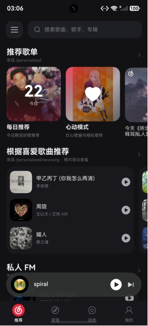
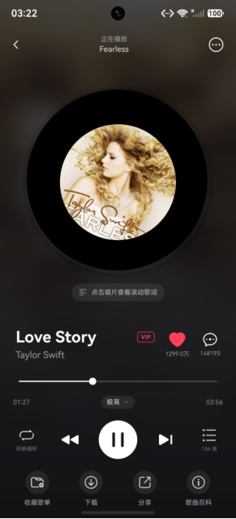
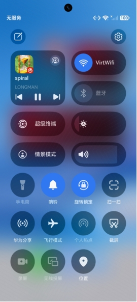
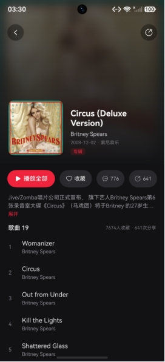
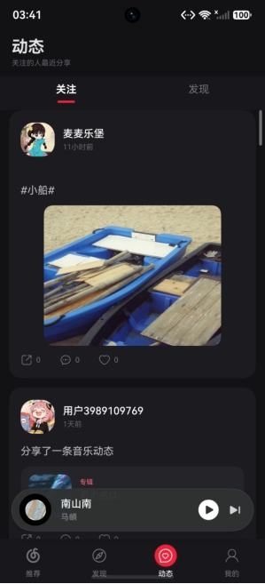
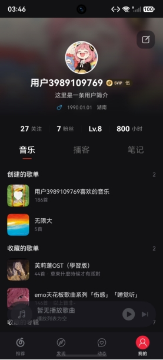

# HarmonyOS Music Player

基于 HarmonyOS Stage 模型的在线音乐播放器客户端，使用 ArkTS + ArkUI 构建，数据源为网易云音乐 NodeJS API。

## 项目信息

| 项目      | 值 |
|---------|-----|
| 包名      | com.hmos.cloudmusic |
| 版本      | 1.0.0 |
| 目标 SDK  | 6.1.1(24) (HarmonyOS) |
| 支持设备    | phone, tablet |
| 主模块     | entry |
| 主 Ability | EntryAbility |
| 项目使用语言  | ArkTS |

## 应用截图

<table>
  <tr>
    <td align="center">推荐页面</td>
    <td align="center">播放详情页</td>
    <td align="center">系统播放组件</td>
  </tr>
  <tr>
    <td></td>
    <td></td>
    <td></td>
  </tr>
  <tr>
    <td align="center">专辑页面</td>
    <td align="center">动态页面</td>
    <td align="center">用户页面</td>
  </tr>
  <tr>
    <td></td>
    <td></td>
    <td></td>
  </tr>
</table>

## 功能模块

### 音乐发现与推荐
- 发现页：轮播 Banner、个性化内容区块
- 推荐页：每日推荐歌单/歌曲、私人 FM、新歌、榜单、歌手榜
- 排行榜：官方榜、精选榜、歌手榜
- 曲风：曲风偏好、曲风详情与分类资源
- 播客/电台：播客 Banner、节目推荐与排行
- 场景音乐 (Sati)：沉浸式场景标签与资源
- 数字专辑：新碟、畅销与风格分类

### 搜索
- 默认关键词、热搜榜、搜索联想
- 多类型搜索：单曲、歌词、专辑、歌手、歌单、用户、MV、视频、播客

### 播放器
- 基于 AVPlayer 的真实音频播放
- 全局共享播放队列 (PlayerStore)
- 播放模式：顺序播放、列表循环、单曲循环、随机播放
- 音质切换：标准 / 较高 / 极高 / 无损 / Hi-Res
- 播放详情页：唱片动画、歌词滚动（原词 + 翻译 + 逐字歌词）、评论、收藏到歌单、下载、分享
- 悬浮迷你播放器 (FloatingMusicCard)

### 后台播放与系统集成
- AVSession 系统媒体会话：锁屏控制、通知栏播放器
- Live View 实况窗状态同步
- 桌面音乐卡片 (MusicCardAbility)：显示当前歌曲，支持播放/暂停/切歌
- PlaybackControlBridge：接收桌面卡片与外部 Want 控制指令
- 后台音频模式 (audioPlayback) + KEEP_BACKGROUND_RUNNING 权限

### 歌单管理
- 歌单详情：歌曲列表、评论、收藏统计
- 创建/编辑歌单：名称、简介、封面上传
- 歌曲管理：搜索添加、移除、排序
- 歌单导入任务

### 专辑与歌手
- 专辑详情、收藏、评论
- 歌手页：热门歌曲、专辑、MV、详情、相似歌手
- MV 播放器：视频播放、评论、点赞、分享、缓存下载

### 用户与社交
- 登录：手机号密码、短信验证码、二维码扫码；未注册号自动补全
- 个人中心：用户资料、会员信息、等级、听歌统计、创建/收藏歌单、收藏专辑、喜欢的歌曲、订阅电台、个人动态
- 用户主页、关注/粉丝列表、关系管理
- 动态流：关注动态、热门话题、点赞、评论、转发
- 消息中心：私信、评论通知、系统通知
- 私聊：文字、歌曲、专辑、歌单消息
- 资料编辑：昵称、签名、性别、生日、地区、头像上传

### 其他
- 歌曲百科：幕后信息、记忆坐标、相关歌曲/歌单、乐谱预览
- AI 歌词辅助：调用外部 AI 接口进行歌词润色/续写
- 系统分享 (ShareKit)
- 设置：API 地址、播放模式、音质、AI 接口配置

## 项目架构

```
entry/src/main/ets/
├── entryability/        # EntryAbility 应用入口
├── entrybackupability/  # EntryBackupAbility 备份扩展
├── musiccard/           # MusicCardAbility 桌面卡片
│   ├── MusicCardAbility.ets
│   └── MusicCard.ets
├── pages/               # 页面 (30+ 页面)
│   ├── Index.ets        # 主入口：NavPathStack + 页签 + 侧边栏 + 悬浮播放器
│   ├── Find.ets         # 发现
│   ├── Recommend.ets    # 推荐
│   ├── Play.ets         # 播放详情
│   ├── Search.ets       # 搜索
│   ├── Login.ets        # 登录
│   ├── Mine.ets         # 我的
│   └── ...
├── components/          # 复用组件
│   ├── Sidebar.ets      # 侧边栏
│   ├── FloatingMusicCard.ets  # 悬浮迷你播放器
│   ├── ShareSheet.ets   # 系统分享与私信联系人选择
│   └── playerNav.ets    # 播放页导航
├── services/            # 服务层
│   ├── ApiClient.ets    # 统一 HTTP 请求封装
│   ├── PlayerController.ets  # AVPlayer 播放控制单例
│   ├── AppSettings.ets  # Preferences 持久化 & 卡片同步
│   ├── LiveViewController.ets  # 实况窗
│   ├── PlaybackControlBridge.ets  # 系统播放 Want 处理
│   ├── ImageUrl.ets     # 图片尺寸参数
│   ├── VipService.ets   # 会员信息转换
│   └── BubbleTip.ets    # 轻量提示
├── stores/              # 状态层
│   ├── AuthStore.ets    # 登录与用户状态
│   └── PlayerStore.ets  # 播放队列与状态
├── models/              # 数据模型
│   ├── api.ets          # 接口响应类型 (用户/登录/搜索/歌单/评论/歌词/百科/消息/动态等)
│   ├── music.ets        # 歌曲/播放模式/音质模型
│   ├── home.ets         # 首页区块模型
│   ├── style.ets        # 曲风模型
│   ├── radio.ets        # 播客模型
│   ├── sati.ets         # 场景音乐模型
│   ├── digitalAlbum.ets # 数字专辑模型
│   └── index.ets        # 统一导出
└── constants/           # 常量与静态数据
    ├── index.ets
    └── MusicConstants.ets
```

### 分层结构

```
HarmonyOS 系统能力层 (AVPlayer / AVSession / NetworkKit / FormKit / ShareKit)
        ↓
应用入口与导航层 (EntryAbility → Index → NavPathStack)
        ↓
页面与组件层 (pages/ + components/)
        ↓
状态与服务层 (AuthStore / PlayerStore / PlayerController / ApiClient / AppSettings)
        ↓
网易云音乐 NodeJS API (第三方数据源)
```

### 关键设计

- **导航**：全部页面使用 `Navigation` + `NavPathStack` + `navDestination`，统一由 Index 页面的 PageMap 注册，不使用 router
- **网络**：`ApiClient` 统一封装 GET / JSON POST / 表单 POST / 文件上传，Cookie 自动附加，每次请求后销毁 HttpRequest
- **播放**：`PlayerController` 单例管理 AVPlayer，通过 playRequestToken 防止快速切歌串歌，多级备用地址策略 (song/url/v1 → song/url → song/download/url/v1)
- **状态**：`@Provide` / `@Consume` 跨组件共享 AuthStore 和 PlayerStore
- **持久化**：Preferences 保存 API 地址、Cookie、用户资料、播放队列、进度、模式和音质；AppSettings 负责读写与同步桌面卡片

## 环境准备

### 开发工具
- DevEco Studio (HarmonyOS SDK 6.1.1(24))
- ArkTS + ArkUI

### 后端 API
本项目使用 [网易云音乐 NodeJS API](https://www.npmjs.com/package/NeteaseCloudMusicApi) 作为数据源，需自行部署：

```bash
git clone https://github.com/Binaryify/NeteaseCloudMusicApi.git
cd NeteaseCloudMusicApi
npm install
node app.js
```

默认端口 `3000`。

### 网络地址配置

| 运行环境 | API 地址 |
|----------|----------|
| 预览器 | `http://127.0.0.1:3000` |
| 模拟器 | `http://10.0.2.2:3000` |
| 真机 | `http://<电脑局域网IP>:3000` |

启动应用后，在侧边栏 → 设置中修改 API 服务地址。

## 构建与运行

1. 使用 DevEco Studio 打开项目
2. 连接设备或启动模拟器
3. 构建并运行 entry 模块

```bash
# 命令行构建
hvigorw assembleHap
```

## 权限声明

| 权限 | 用途 |
|------|------|
| `ohos.permission.INTERNET` | 网络请求 |
| `ohos.permission.KEEP_BACKGROUND_RUNNING` | 后台音频播放 |

## 已知限制

- 本项目为客户端前端，**未自建**后端服务、数据库或管理后台；所有业务数据来自网易云音乐第三方 API，部分功能由于接口缺失导致无法实现
- AI 写歌功能为客户端辅助界面，调用用户配置的外部 LLM AI 接口，未实现多模态与音乐生成
- 部分功能（会员购买、商城、票务、创作者中心）仅保留界面入口，依赖网易云官方页面
- 下载文件保存在应用沙箱目录，导出到公共目录需要额外 FilePicker 授权
- 部分高音质/付费/版权歌曲实际播放效果受账号权限与版权限制

## 技术栈

- **语言**：ArkTS
- **UI 框架**：ArkUI (声明式)
- **应用模型**：Stage 模型
- **网络**：NetworkKit (http)
- **媒体**：MediaKit (AVPlayer)
- **媒体会话**：AVSessionKit
- **数据持久化**：Preferences (ArkData)
- **桌面卡片**：FormKit
- **分享**：ShareKit
- **测试**：Hypium + Hamock
